<h1 align="center">FTP paso a paso</h1>

<!-- Estatus de desarrollo sacado de https://www.aluracursos.com/blog/como-escribir-un-readme-increible-en-tu-github -->

  

# Creacion de FTP

 - Hacemos un .gitignore para ignorar el .vagrant.
 - Copiamos el vagrantfile para tener una base funcional. y luego ir modificando lo que necesitemos 
 - Creamos una estructura basica para imagenes que podamos necesitar.

## Pasos a pasos ftp
 - Lo primero que necesitamos es tener un servidor DNS que usaremos de DNS-Paso-a-Paso
 - lo siguiente es crear en el vagrantfile otro servidor con los datos que queremos que tenga el servidor ftp otra ip diferente y un hostname diferente, y un bootstrap de aprovisionamiento diferente.
 - iniciamos un vagrant up dns para levantar el servidor de dns y comprobaremos que el bootstrap esta bien y que nuestra maquina dns este perfecta.
    - Hacemos un systemctl status bind9 para ver si esta activo y esta funcionando.
    
    - Lo siguiente es comprobar que funciona con dig.
    
    

## ftp grafico
 - Descargamos Filezilla cliente.
 
 -Cramos una carpeta con un txt con datos para usarlo como ejemplo.
 
 -Nos conectamos a ftp.cica.es y nos descargamos a nuestra carpeta el archivo que es /pub/check
 
 
 - Para comprobarlo en el buscador de archivos, o en filezilla en la parte nuestra le damos click derecho y abrir y nos sale nuetra carpeta le he dado a abrir al archivo y bloc de notas.
 
 - Y desde el cliente si intentamos subir nuestro archivo no nos deja por que no tenemos permisos
  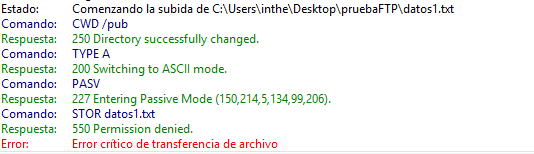

## VSFTPD Linux
 - Instalamos VSFTPD (apt install -y vsftpd)
 - Comprobamos que se ha instalado correctamente usamos para encontrarlo (grep ftp /etc/passwd)
 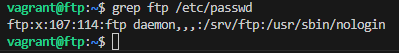
 - Comprobamos que se ha creado el directorio /srv/ftp y que el usuario es root y pertenece al grupo ftp
 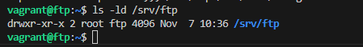
 - Comprobamos que usuarios no pueden acceder al servicio. (etc/ftpusers)
 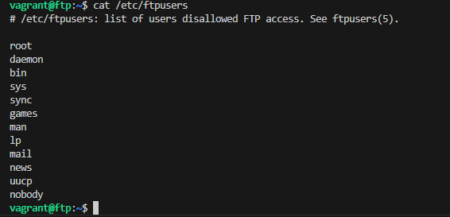
 -Ahora comprobamos que el servicio esta activo y funcionando
 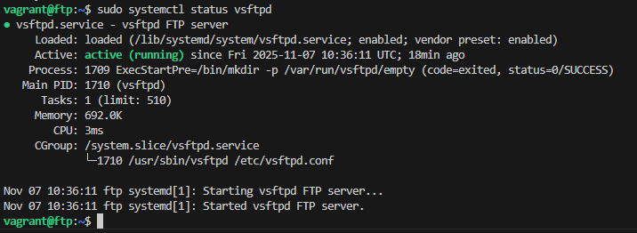
 - Comprobacion que esta escuchando por el puerto 21
 <!-- Use al principio netstat -tln que pone en el pdf pero me sale command not found -->
 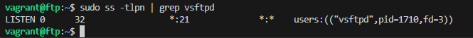
 - Lo siguiente es crear una copia de seguridad del archivo   pero en mi caso voy a hacer un cp y mandarlo fuera de la maquina a /vagrant/configFTP
 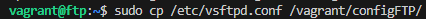
 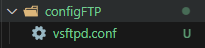
 - Creamos usuarios (useradd -m 'nombre')  <!-- la m se utiliza para crear un directorio del usuario-->
 
 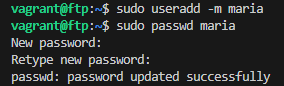
 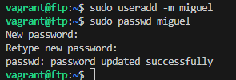
 - Creamos ficheros de prueba 
    - Lo comprobamos que se hayan creado
 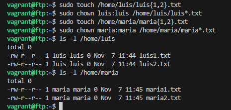
 - Por ultimo configuramos el archivo que anteriormente se hizo una copia de seguridad para ahora poder modificar que lo que hace es darle permisos o quitarle permisos a los usuarios y poner resrticciones generales 
    - Tenemos que crear un archivo con el user de maria por que esta no estara enjaulado (nano /etc/vsftpd.chroot_list y ponemos maria)
    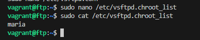
    - Modificamos el archivo de configuracion de vsftpd
    [Primera parte archivo](doc/assets/img/PrimeraParteArchivoConf.png)
    [Segunda parte archivo](doc/assets/img/SegundaParteArchivoConf.png) <!-- Solo añade la ultima linea por que no entra en la captura  -->
    - Vemos desde un equipo si podemos acceder, desde mi equipo fuera de las maquinas virtuales voy a intntar acceder mediante cmd
        - Vemos que si no tengo usuario creado da error y te mete en anonimo y no tienes permisos de crear y si te sabes alguna cuenta puedes acceder con esa cuenta y contraseña
    [Prueba cmd](doc/assets/img/PruebaMetermeCMD.png)
    - Comprobamos ahora con maria y vemos si no estamos enjaulados lo miramos desde filezilla
    [Filezilla Maria](doc/assets/img/filezillaMaria.png)
    -Comprobamos con luis
    [Filezilla Luis](doc/assets/img/filezillaLuis.png)