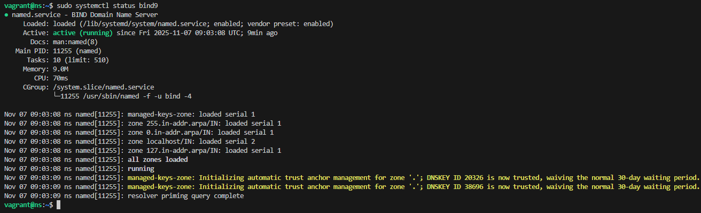
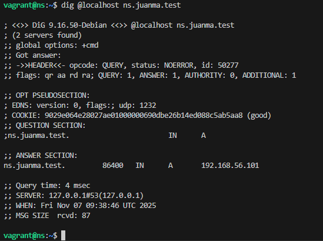
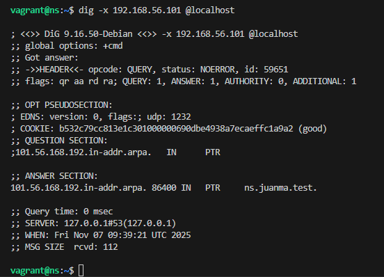
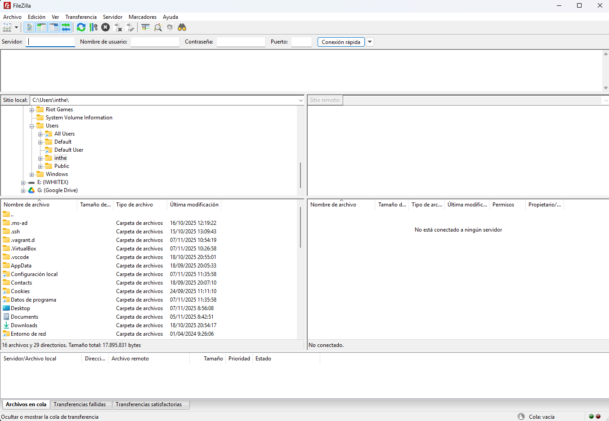
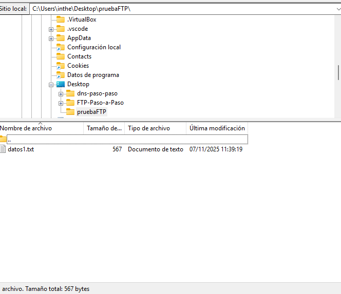
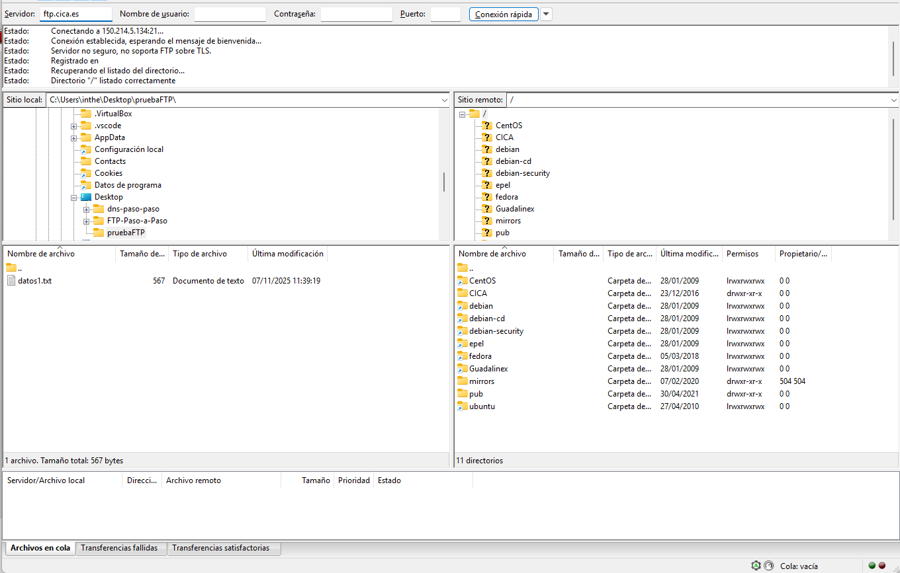
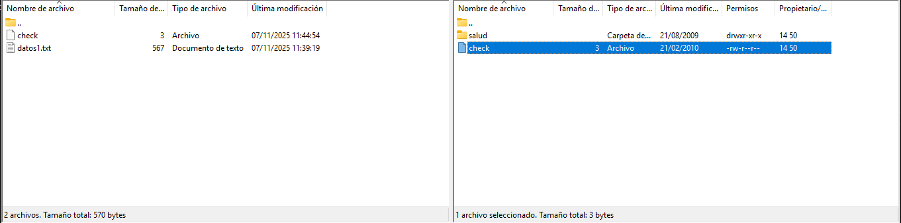
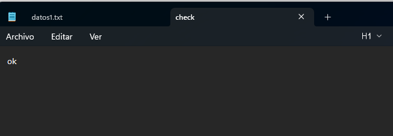

<h1 align="center">FTP paso a paso</h1>

<!-- Estatus de desarrollo sacado de https://www.aluracursos.com/blog/como-escribir-un-readme-increible-en-tu-github -->

  

# Creacion de FTP

 - Hacemos un .gitignore para ignorar el .vagrant.
 - Copiamos el vagrantfile para tener una base funcional. y luego ir modificando lo que necesitemos 
 - Creamos una estructura basica para imagenes que podamos necesitar.

## Pasos a pasos ftp
 - Lo primero que necesitamos es tener un servidor DNS que usaremos de DNS-Paso-a-Paso
 - lo siguiente es crear en el vagrantfile otro servidor con los datos que queremos que tenga el servidor ftp otra ip diferente y un hostname diferente, y un bootstrap de aprovisionamiento diferente.
 - iniciamos un vagrant up dns para levantar el servidor de dns y comprobaremos que el bootstrap esta bien y que nuestra maquina dns este perfecta.
    - Hacemos un systemctl status bind9 para ver si esta activo y esta funcionando.
    
    - Lo siguiente es comprobar que funciona con dig.
    
    

## ftp grafico
 - Descargamos Filezilla cliente.
 
 -Cramos una carpeta con un txt con datos para usarlo como ejemplo.
 
 -Nos conectamos a ftp.cica.es y nos descargamos a nuestra carpeta el archivo que es /pub/check
 
 
 - Para comprobarlo en el buscador de archivos, o en filezilla en la parte nuestra le damos click derecho y abrir y nos sale nuetra carpeta le he dado a abrir al archivo y bloc de notas.
 